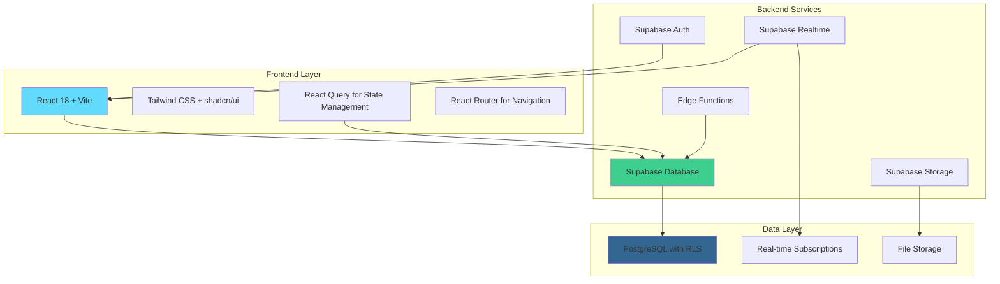

# 🚍 RouteAura - Advanced Bus Booking & Fleet Management Platform

<div align="center">


**The complete solution for modern bus transportation management**

[](https://reactjs.org/)
[](https://supabase.com/)
[](https://tailwindcss.com/)
[](https://ui.shadcn.com/)

</div>

---

## 🌟 Overview

RouteAura is a comprehensive, modern bus booking and fleet management platform that bridges the gap between passengers seeking convenient travel booking and transport companies requiring robust operational management. Built with cutting-edge technologies, it offers a seamless experience for online seat booking, real-time fleet management, and comprehensive business analytics.

### 🎯 Core Mission
- **For Passengers**: Simplify route discovery, seat booking, and journey management
- **For Operators**: Provide powerful tools for fleet, route, and booking management
- **For Admins**: Enable data-driven decisions through comprehensive analytics

---

## ✨ Key Features

### 🧑‍🦰 Passenger Experience
- **Smart Route Discovery**: Advanced search with real-time availability
- **Interactive Seat Selection**: Live seat maps with real-time booking updates
- **Multi-Fleet Options**: Choose from Standard, Premium, and Luxury buses
- **Digital Receipts**: Instant receipt generation with QR codes
- **Booking Management**: View, reschedule, and manage bookings
- **Mobile-First Design**: Responsive interface optimized for all devices

### 🏢 Admin Capabilities
- **Comprehensive Dashboard**: Real-time KPIs, analytics, and insights
- **Fleet Management**: Complete bus fleet configuration and monitoring
- **Route Administration**: Dynamic route creation with flexible pricing
- **Booking Operations**: Manual booking creation and management
- **User Management**: Customer profile and authentication handling
- **Content Management**: Live website content editing and SEO optimization
- **Multi-Branch Support**: Hierarchical access control and data isolation

### 🔧 Technical Excellence
- **Real-Time Updates**: Live seat availability using Supabase Realtime
- **Advanced Security**: Row-Level Security (RLS) with role-based access
- **Data Export**: Comprehensive reporting and CSV/Excel export
- **Scalable Architecture**: Built for growth with modern web technologies

---

## 🏗️ System Architecture



---

## 📁 Project Structure

```
src/
├── 📂 components/
│   ├── 📂 admin/                           # Admin dashboard components
│   │   ├── 📂 content-management/          # CMS components
│   │   ├── 📂 RoutesManagement/           # Route management
│   │   ├── 📂 receipt-management/         # Receipt handling
│   │   └── 📄 AdminDashboard.tsx          # Main admin interface
│   ├── 📂 auth/                           # Authentication components
│   │   ├── 📄 SignupForm.tsx              # User registration
│   │   └── 📄 SocialAuthButtons.tsx       # Social login options
│   ├── 📂 booking/                        # Booking flow components
│   │   ├── 📂 components/                 # Booking sub-components
│   │   ├── 📂 hooks/                      # Booking-related hooks
│   │   └── 📄 EnhancedAutoBookingFormWithFleet.tsx
│   ├── 📂 layout/                         # Layout components
│   │   ├── 📄 Navbar.tsx                  # Main navigation
│   │   └── 📄 Footer.tsx                  # Site footer
│   └── 📂 ui/                             # Reusable UI components (shadcn/ui)
├── 📂 contexts/                           # React context providers
│   ├── 📄 AuthContext.tsx                 # User authentication
│   ├── 📄 AdminAuthContext.tsx            # Admin authentication
│   └── 📄 BranchContext.tsx               # Branch management
├── 📂 hooks/                              # Custom React hooks
│   ├── 📄 useFleetData.tsx                # Fleet management
│   └── 📄 useSiteSettings.ts              # Site configuration
├── 📂 integrations/
│   └── 📂 supabase/
│       ├── 📄 client.ts                   # Supabase client configuration
│       └── 📄 types.ts                    # Database type definitions
├── 📂 pages/                              # Route-based page components
│   ├── 📂 admin/                          # Admin-only pages
│   ├── 📂 home/                           # Homepage components
│   ├── 📄 BookingPage.tsx                 # Booking interface
│   ├── 📄 FleetPage.tsx                   # Fleet showcase
│   └── 📄 RoutesPage.tsx                  # Available routes
└── 📂 utils/                              # Utility functions
```

---

## 🗄️ Database Schema & Supabase Integration

### Core Tables Structure

#### 🔐 Authentication & Users
- **`auth.users`** - Supabase managed user authentication
- **`profiles`** - Extended user information
- **`admin_users`** - Administrative user profiles
- **`admin_auth`** - Admin authentication credentials
- **`branch_admins`** - Branch-admin relationships

#### 🚌 Fleet & Operations
- **`fleet`** - Bus fleet configuration and details
- **`routes`** - Available travel routes
- **`route_fleet_pricing`** - Custom pricing per route-fleet combination
- **`bus_schedules`** - Schedule management for buses
- **`seat_availability`** - Real-time seat booking status

#### 📋 Bookings & Transactions
- **`bookings`** - Customer booking records
- **`manual_bookings`** - Admin-created bookings
- **`receipts`** - Payment and receipt management
- **`reschedule_requests`** - Booking modification requests

#### 🏢 Organization
- **`branches`** - Multi-branch organization support
- **`locations`** - Pickup/drop-off locations
- **`drivers`** - Driver information and assignments

---

## 🔌 Supabase Integration Points

### 📍 Key Integration Locations

#### Authentication Calls
```typescript
// User Authentication
src/contexts/AuthContext.tsx                    // Main user auth
src/contexts/AdminAuthContext.tsx               // Admin authentication
src/pages/LoginPage.tsx                         // User login
src/pages/admin/AdminLoginPage.tsx              // Admin login
```

#### Data Fetching Hooks
```typescript
// Fleet Management
src/hooks/useFleetData.tsx                      // Fleet operations
src/components/admin/FleetManagement.tsx        // Admin fleet management

// Booking Operations
src/components/booking/hooks/useBookingData.tsx // Booking data
src/components/booking/hooks/useBookingMutation.tsx // Booking mutations
src/pages/home/hooks/useHomeData.ts             // Homepage data

// Route Management
src/components/admin/RoutesManagement/useRoutesData.tsx // Route operations
```

#### Real-time Features
```typescript
// Seat Availability
src/components/booking/hooks/useSeatManagement.tsx      // Live seat updates
src/components/booking/EnhancedSeatSelector.tsx         // Real-time seat map

// Fleet Management
src/components/booking/hooks/useFleetManagement.tsx     // Bus assignment
```

#### Admin Operations
```typescript
// Content Management
src/components/admin/ContentManagement.tsx              // CMS operations
src/components/admin/content-management/contentOperations.ts // Content CRUD

// User Management
src/components/admin/AdminUsersManagement.tsx           // Admin user operations
src/components/admin/UsersManagement.tsx                // Customer management

// Analytics & Reporting
src/components/admin/AnalyticsDashboard.tsx             // Dashboard analytics
src/components/admin/DataExportManager.tsx              // Data export
```

### 🔄 Real-time Subscriptions
- **Seat Availability**: Live updates during booking process
- **Bus Schedules**: Real-time schedule modifications
- **Booking Status**: Instant booking confirmations

### 🛡️ Security Implementation
- **Row Level Security (RLS)**: Implemented on all sensitive tables
- **Role-based Access**: Superadmin vs Branch admin permissions
- **Data Isolation**: Branch-specific data access controls

---

## 🚀 Getting Started

### Prerequisites
- **Node.js** 18+ 
- **npm** or **yarn**
- **Supabase Account** (for backend services)

### Installation

1. **Clone the Repository**
   ```bash
   git clone <repository-url>
   cd routeaura-booking-platform
   ```

2. **Install Dependencies**
   ```bash
   npm install
   ```

3. **Environment Configuration**
   
   The Supabase configuration is already set up in:
   ```typescript
   // src/integrations/supabase/client.ts
   const SUPABASE_URL = "https://jjwqyevuyysdvgbxykqs.supabase.co";
   const SUPABASE_PUBLISHABLE_KEY = "your-anon-key";
   ```

4. **Start Development Server**
   ```bash
   npm run dev
   ```

5. **Access the Application**
   - **Frontend**: http://localhost:5173
   - **Admin Panel**: http://localhost:5173/route-aura-booking-admin-page/dashboard

---

## 👥 User Roles & Access

### 🧑‍🦰 Passengers
- Browse available routes and schedules
- Book seats with real-time availability
- Manage personal bookings and receipts
- Request booking modifications
- Leave reviews and feedback

### 👨‍💼 Branch Admins
- Access to assigned branch data only
- Manage bookings for their branch
- Create manual bookings
- Handle customer support requests
- Generate reports for their branch

### 🔧 Superadmins
- Full system access across all branches
- Manage fleet, routes, and schedules
- User and admin account management
- Content management system access
- System-wide analytics and reporting
- Data export capabilities

---

## 🎨 UI/UX Design System

### Design Philosophy
- **Mobile-First**: Responsive design optimized for all screen sizes
- **Accessibility**: WCAG 2.1 compliant with proper ARIA labels
- **Performance**: Optimized for fast loading and smooth interactions
- **Consistency**: Unified design language across all components

### Component Library
- **shadcn/ui**: Modern, accessible component library
- **Tailwind CSS**: Utility-first CSS framework
- **Lucide Icons**: Consistent iconography
- **Sonner**: Toast notifications for user feedback

### Color Palette
```css
--primary: #2563eb      /* Brand Blue */
--secondary: #16a34a    /* Success Green */
--accent: #dc2626       /* Error/Alert Red */
--muted: #6b7280        /* Text Secondary */
--background: #ffffff   /* Main Background */
```

---

## 📊 Analytics & Reporting

### Dashboard Metrics
- **Booking Analytics**: Volume, revenue, and conversion rates
- **Fleet Utilization**: Occupancy rates and performance metrics
- **User Engagement**: Registration, retention, and satisfaction
- **Route Performance**: Popular routes and demand patterns

### Export Capabilities
- **Booking Reports**: Detailed booking data with filters
- **Financial Reports**: Revenue analysis and payment tracking
- **User Reports**: Customer demographics and behavior
- **Operational Reports**: Fleet and route performance

---

## 🔧 Development Workflow

### Code Quality
```bash
# Linting
npm run lint

# Type checking
npm run type-check

# Testing
npm run test
```

### Build Process
```bash
# Development build
npm run dev

# Production build
npm run build

# Preview production build
npm run preview
```

### Deployment
The application is optimized for deployment on:
- **Vercel** (Recommended)
- **Netlify**
- **Any static hosting platform**

---

## 🛠️ Technical Stack

| Category | Technology | Purpose |
|----------|------------|---------|
| **Frontend Framework** | React 18 | Component-based UI development |
| **Build Tool** | Vite | Fast development and building |
| **Language** | TypeScript | Type-safe development |
| **Styling** | Tailwind CSS | Utility-first CSS framework |
| **UI Components** | shadcn/ui | Pre-built accessible components |
| **State Management** | TanStack Query | Server state management |
| **Routing** | React Router | Client-side routing |
| **Backend** | Supabase | Database, Auth, and APIs |
| **Database** | PostgreSQL | Relational database with RLS |
| **Real-time** | Supabase Realtime | Live data synchronization |
| **Authentication** | Supabase Auth | User and admin authentication |
| **Icons** | Lucide React | Consistent iconography |
| **Notifications** | Sonner | Toast notifications |
| **Charts** | Recharts | Data visualization |

---

## 🔐 Security Features

### Authentication & Authorization
- **Multi-factor Authentication**: Secure user access
- **Role-based Access Control**: Granular permissions
- **Session Management**: Secure session handling
- **Password Security**: Encrypted password storage

### Data Protection
- **Row Level Security**: Database-level access control
- **Data Encryption**: Sensitive data encryption
- **Input Validation**: Comprehensive input sanitization
- **CORS Protection**: Cross-origin request security

### Compliance
- **GDPR Ready**: Privacy-compliant data handling
- **Audit Logging**: Comprehensive activity tracking
- **Data Backup**: Regular automated backups
- **SSL/TLS**: Encrypted data transmission

---

## 🚀 Performance Optimizations

### Frontend Optimizations
- **Code Splitting**: Lazy loading of route components
- **Image Optimization**: Responsive images with lazy loading
- **Bundle Analysis**: Optimized bundle sizes
- **Caching Strategy**: Efficient browser caching

### Backend Optimizations
- **Database Indexing**: Optimized query performance
- **Connection Pooling**: Efficient database connections
- **Edge Functions**: Serverless compute for custom logic
- **CDN Integration**: Global content distribution

---

## 🤝 Contributing

### Development Guidelines
1. **Follow TypeScript**: Maintain type safety throughout
2. **Component Structure**: Create focused, reusable components
3. **Testing**: Write comprehensive tests for new features
4. **Documentation**: Update documentation for significant changes

### Pull Request Process
1. Fork the repository
2. Create a feature branch
3. Implement changes with tests
4. Update documentation
5. Submit pull request with detailed description

---

## 📝 API Documentation

### Core Endpoints

#### Booking Management
```typescript
// Create booking
POST /bookings
// Get user bookings
GET /bookings?user_id={id}
// Update booking status
PATCH /bookings/{id}
```

#### Fleet Operations
```typescript
// Get available fleet
GET /fleet?route_id={id}&date={date}
// Get seat availability
GET /seat-availability?route_id={id}&date={date}
```

#### Admin Operations
```typescript
// Get analytics data
GET /admin/analytics?branch_id={id}
// Export booking data
GET /admin/export/bookings
```

---

## 🐛 Troubleshooting

### Common Issues

#### Authentication Problems
```bash
# Clear browser storage
localStorage.clear()
sessionStorage.clear()

# Verify Supabase connection
# Check src/integrations/supabase/client.ts
```

#### Build Errors
```bash
# Clear node modules and reinstall
rm -rf node_modules package-lock.json
npm install
```

#### Database Connection
```bash
# Verify Supabase project status
# Check network connectivity
# Validate API keys
```

---

## 📚 Additional Resources

### Documentation Links
- [React Documentation](https://reactjs.org/docs)
- [Supabase Documentation](https://supabase.com/docs)
- [Tailwind CSS Docs](https://tailwindcss.com/docs)
- [shadcn/ui Components](https://ui.shadcn.com/)

### Community & Support
- [Project Issues](https://github.com/your-repo/issues)
- [Discussions](https://github.com/your-repo/discussions)
- [Discord Community](https://discord.gg/your-invite)

---

## 📄 License

This project is licensed under the MIT License - see the [LICENSE](LICENSE) file for details.

---

## 🙏 Acknowledgments

- **Supabase Team** for the excellent backend platform
- **shadcn** for the beautiful UI component library
- **Tailwind CSS** for the utility-first approach
- **React Team** for the amazing framework
- **All Contributors** who have helped improve this platform

---

<div align="center">

**RouteAura - Making journey management delightful for everyone** 🚎✨

*Built with ❤️ using modern web technologies*

</div>
